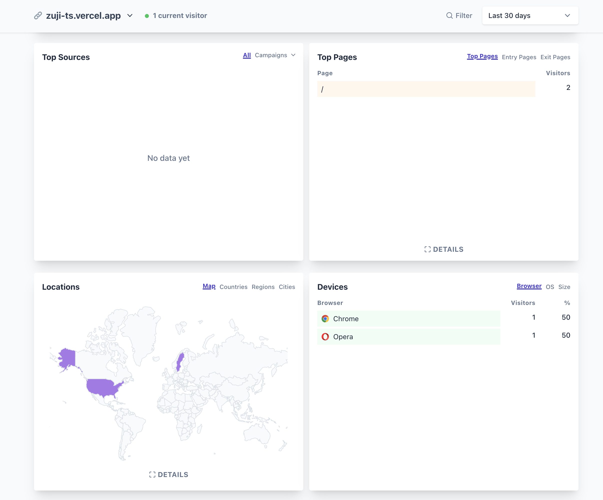

# Vince Analytics Railway Template

This template allows you to deploy Vince Analytics on Railway with minimal configuration.

**Why is this cool?**: Analytics services like Plausible require expensive to run dependencies like Clickhouse, which is overkill for most users. Vince Analytics is a lightweight alternative that runs on a single server, a Go binary that takes advantages of optimized storage technologies like roaring bitmaps.

You can save _lots_ of money by using Vince Analytics instead of other analytics services if it's capable enough for your use case.

## Deployment Steps

1. **Deploy on Railway**  
   Click the button below to deploy:

2. **Configure Environment Variables**  
   When deploying, set the following environment variables in the Railway dashboard, when prompted to during template deployment:

   - `VINCE_ADMIN_NAME`: The admin username for Vince Analytics.
   - `VINCE_ADMIN_PASSWORD`: The admin password for Vince Analytics, this is what you'll use to log in.

3. **Access the Vince Analytics Dashboard**  
   Once the deployment is complete, a Railway managed domain with SSL and a subdomain will be generated to access Vince Analytics.

4. **Login**  
   Use the credentials you configured in the environment variables to log in. You'll usually just be prompted for the password.

You'll then be able to add a domain for tracking, prompting you to add a tracking code to your website. Once a domain is added, you'll be able to view your data in the dashboard.

---

## Notes

- Railway automatically manages container restarts and scaling.
- A volume is mounted to the container to persist data between server restarts.
- To change your admin credentials, you'll need to update the environment variables in the Railway dashboard and redeploy.

For further information about Vince Analytics, visit the [official website](https://vinceanalytics.com).
